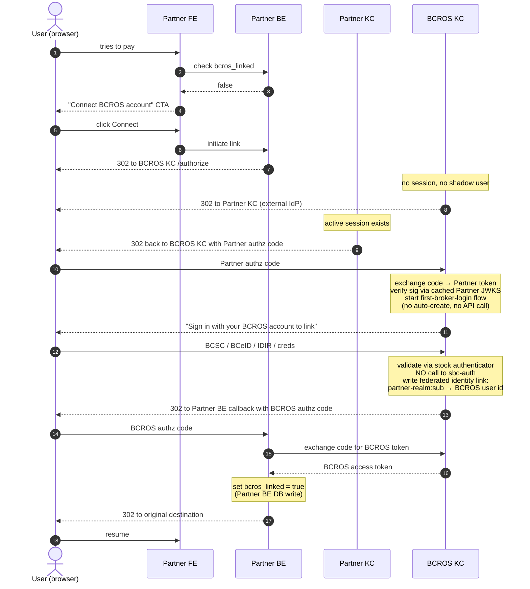
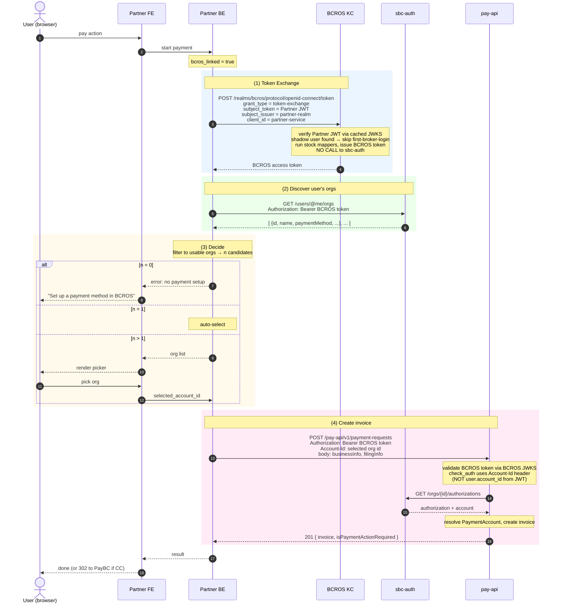
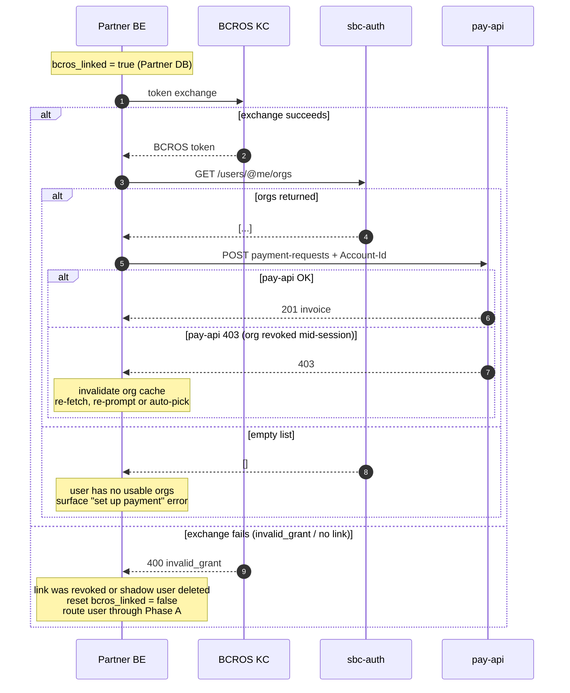

# External-Realm Partner Integration (OIDC Token Exchange)

For partner apps whose users authenticate against a **different Keycloak realm** (the *Partner realm*) than BCROS (*BCROS realm*), but who want to charge those users to their existing BCROS accounts via pay-api.

This document specifies the identity federation flow, the account-discovery step, and how the pay-api call is made — end to end.

## Problem

- Users log into the partner app with **Partner-realm** tokens.
- pay-api expects **BCROS-realm** tokens.
- A single Partner-realm user may map to **1..N BCROS accounts** (orgs).
- BCROS Keycloak **cannot** run custom protocol mappers or authenticators that call sbc-auth.
- BCROS users may or may not have an email attribute; email cannot be used as an identity join key.

## Solution overview

- **Identity bridge**: BCROS Keycloak trusts Partner Keycloak as an external OIDC IdP. OAuth 2.0 Token Exchange (RFC 8693) converts a Partner-realm token into a BCROS-realm token, headlessly.
- **User linking**: Established once, interactively, by the user proving ownership of a pre-existing BCROS account (BCSC / BCeID / IDIR / creds). No email match, no auto-provisioning.
- **Account discovery**: Partner backend fetches the user's BCROS org list via sbc-auth and either auto-selects or shows a picker.
- **pay-api call**: Partner backend always sends the chosen `Account-Id` header explicitly. The BCROS token does not carry a dynamic account claim.

## Design constraints (invariants)

| Constraint | How honoured |
|---|---|
| BCROS Keycloak never calls sbc-auth | All account/org lookups are done by the Partner backend or pay-api |
| No email-based identity matching | Linking done by re-authentication in the interactive flow |
| Users must have a pre-existing BCROS account | First-broker-login flow has no auto-create step |
| Partner app does not persist BCROS account IDs in its domain model | Fetched per session; only `bcros_linked` boolean is stored |
| Partner backend always sends `Account-Id` to pay-api | JWT-derived `user.account_id` is intentionally ignored |

## Cast

- **User** — real person, browser session
- **Partner FE** — customer app frontend
- **Partner BE** — customer app backend (holds tokens, calls APIs)
- **Partner KC** — Partner realm Keycloak (customer's realm)
- **BCROS KC** — BCROS realm Keycloak (our realm)
- **sbc-auth** — sbc-auth API
- **pay-api** — pay-api

## Prerequisites (one-time configuration)

Before any user flow works, the following must be in place.

**BCROS Keycloak**

- Partner realm registered as an external OIDC identity provider (alias, e.g. `partner-realm`; discovery URL = Partner realm's `.well-known/openid-configuration`).
- Client `partner-service` (confidential) created. Token exchange permission granted for the `partner-realm` IdP.
- First-broker-login flow configured with:
  - **"Create User If Unique"** step disabled or removed.
  - **"IdP Link Only"** (or equivalent "Handle Existing Account") authenticator set to Required.
  - No custom authenticators that make HTTP calls to sbc-auth.
- Standard attribute-to-claim mappers only (no scripts or REST calls).

**Partner backend**

- Client credentials for `partner-service` on BCROS Keycloak.
- Database column: `users.bcros_linked : boolean` (default `false`).
- Callback endpoint registered as the redirect URI for the linking flow.

**Users**

- Must have an existing BCROS account. Any BCROS login source is acceptable (BCSC, BCeID, IDIR, username/password). If a user has none, they must be sent to auth-web to create one before linking will succeed.

## Phase A — First-time linking (once per user)

Triggered when the Partner backend sees `bcros_linked = false`.

### Walk-through

1. User initiates a payable action; Partner backend sees the user is not linked.
2. Partner backend starts a standard OIDC authorization-code flow against **BCROS Keycloak**.
3. BCROS Keycloak has no session and no matching shadow user, so it redirects the user to Partner Keycloak (the external IdP).
4. Partner Keycloak has an active session and silently issues an authorization code back to BCROS Keycloak.
5. BCROS Keycloak exchanges the code for a Partner-realm token and starts the **first-broker-login flow**. Because there is no shadow user and no auto-create step, the user is presented with a BCROS sign-in prompt.
6. User authenticates using their existing BCROS credentials — whatever login source they normally use.
7. On successful BCROS authentication, Keycloak writes a **federated identity link** (`partner-realm:sub → BCROS user id`) and continues the auth-code flow, redirecting to the Partner backend callback.
8. Partner backend exchanges the code for a BCROS access token (confirming linking succeeded), sets `bcros_linked = true` in its database, and returns the user to the original destination.

Linking is now permanent. All subsequent payments use Phase B.

## Phase B — Every payment (headless after linking)

### Walk-through

**(1) Token exchange.** Partner backend takes the Partner-realm token it already has for the user and calls BCROS Keycloak's token endpoint with `grant_type = urn:ietf:params:oauth:grant-type:token-exchange`. BCROS Keycloak verifies the Partner JWT via its cached JWKS, finds the existing shadow user, skips the first-broker-login flow, runs stock protocol mappers, and returns a BCROS access token. No call to sbc-auth.

**(2) Org discovery.** Partner backend calls sbc-auth (`GET /users/@me/orgs`, or the equivalent user-orgs endpoint) using the BCROS token. The response lists the user's org memberships with enough payment-method metadata to filter.

**(3) Decide.** Partner backend filters to orgs that can actually pay (the user has the right role, and the org has a usable payment method configured).

- **0 usable orgs** — surface a "set up a payment method" error to the user with a link to auth-web.
- **1 usable org** — auto-select.
- **>1 usable orgs** — send the list to the frontend and render a picker.

**(4) Create invoice.** Partner backend calls pay-api with `Authorization: Bearer <BCROS token>` and `Account-Id: <selected>`. pay-api validates the token, uses the explicit `Account-Id` (not the JWT claim) in `check_auth`, resolves the `PaymentAccount`, and creates the invoice.

Response goes back to the frontend. If the payment method requires a hosted checkout (credit card via PayBC), the user is redirected; otherwise, payment is complete.

## Failure paths

Drift and error handling between Partner state and BCROS state.

Handled cases:

- **Token exchange returns `invalid_grant`.** The federated identity link has been revoked, or the shadow user was deleted on the BCROS side. Reset `bcros_linked = false` and send the user through Phase A on their next attempt.
- **Org discovery returns an empty list.** Linked user has no usable BCROS orgs (never had any, lost their membership, or none have a payment method set up). Surface a clear error with a link to auth-web.
- **pay-api returns 403 mid-flow.** The selected org was revoked between picker and invoice creation. Invalidate the org cache, refetch, and either auto-pick from the new list or re-prompt.
- **User cancels or fails BCROS re-authentication in Phase A.** BCROS returns an error to the Partner callback. Keep `bcros_linked = false` and offer retry.

## Where the constraints show up

| Constraint | Enforced at |
|---|---|
| BCROS Keycloak never calls sbc-auth | Phase A step 7 (link via re-auth, no API) and Phase B step 1 (mappers are stock attribute→claim) |
| No email matching | Phase A step 6 (user proves ownership via full BCROS auth) |
| Prerequisite BCROS account | Phase A step 5 (first-broker-login has no create step; users without a BCROS account cannot complete step 6) |
| Partner app doesn't persist Account-Ids | Phase B — org list lives only in session between steps 2 and 4 |
| Account-Id sent explicitly to pay-api | Phase B step 4 header |
| BCROS token doesn't carry dynamic org context | pay-api ignores `user.account_id` from JWT when `Account-Id` header is present |

## Invariants worth internalising

1. **BCROS Keycloak never talks to sbc-auth.** It only issues tokens based on what it knows internally (stock mappers over static attributes and federated identity records).
2. **The BCROS token authenticates the user; the `Account-Id` header selects the org.** These two pieces of information travel separately and are joined at pay-api's `check_auth`.
3. **The Partner backend is the only piece that ties identity to org.** It fetches, decides, and passes the header. Everything else is stock.

## Related documents

- [Credit Card Payment Integration Guide](credit-card-payment.md) — the payment-side redirect flow for CC (PayBC hosted page).
