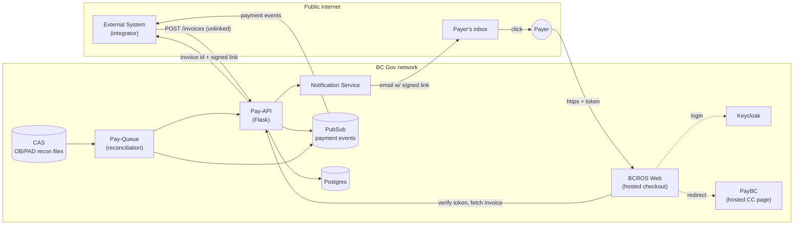
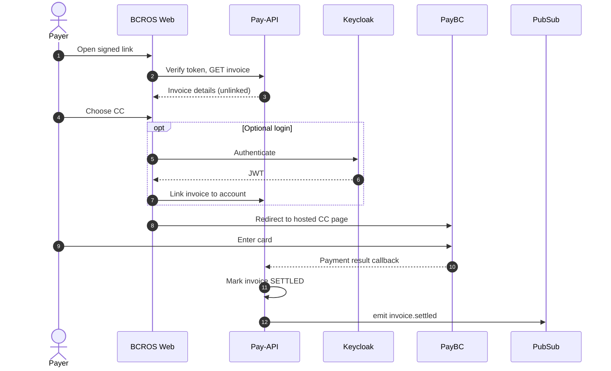
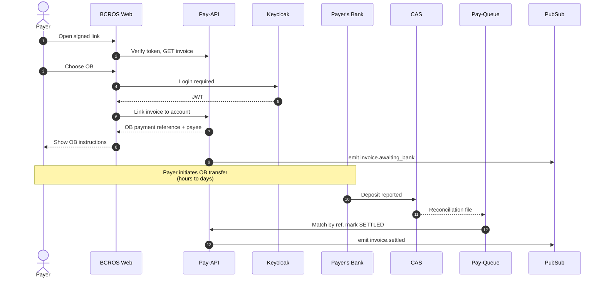
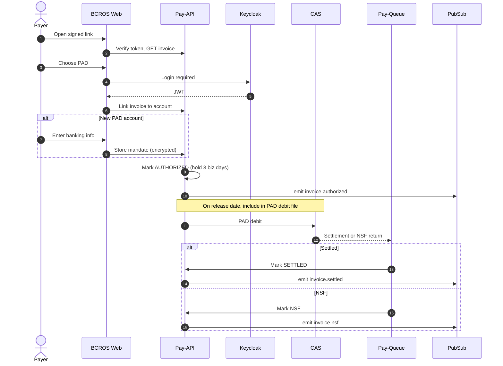
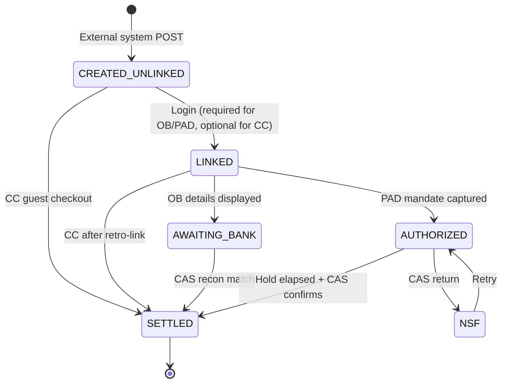

# Externally-Initiated Invoice Flow

Design for a hosted payment flow where an **external system** creates an
invoice in Pay-API without a linked BC Registries account, and the payer
completes payment on a hosted BCROS checkout via a signed email link.

Three payment rails are supported:

- **CC** — credit card via PayBC hosted page (guest or optional login)
- **OB** — online banking (login required, settlement via CAS recon)
- **PAD** — pre-authorized debit (login required, hold window before release)

The signed link is an **invoice locator**, not an auth token. Payer identity
is established by the rail itself (PayBC for CC, Keycloak for OB/PAD).

## 1. Container diagram

## 2. Sequence — CC (guest + optional login)

## 3. Sequence — Online Banking

## 4. Sequence — PAD

## 5. Invoice state

## Open decisions

- **CC retro-link timing** — currently shown *before* PayBC redirect so the
  receipt lands on the right account. Alternative: link on PayBC callback.
- **OB event name** — `invoice.awaiting_bank` is a placeholder; align with
  existing CloudEvents taxonomy in `pay-api` publishers.
- **PAD hold window for externally-initiated invoices** — 3 business days
  proposed as default (first-time payer, no NSF history), even though
  internally-initiated PAD releases same-day today.
- **Signed link TTL and single-use enforcement** — TBD; low-severity leak
  risk but worth capping.
