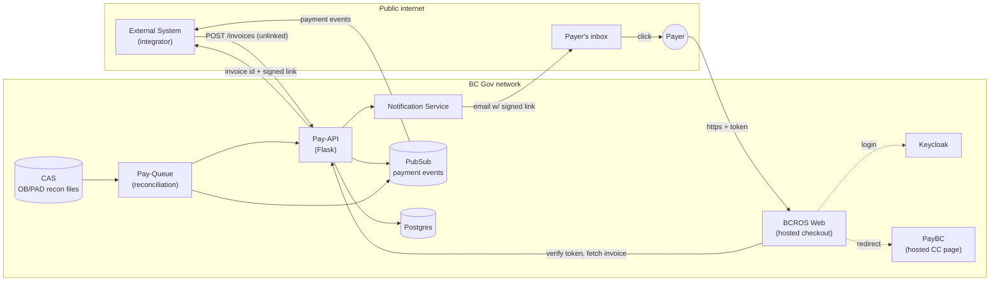
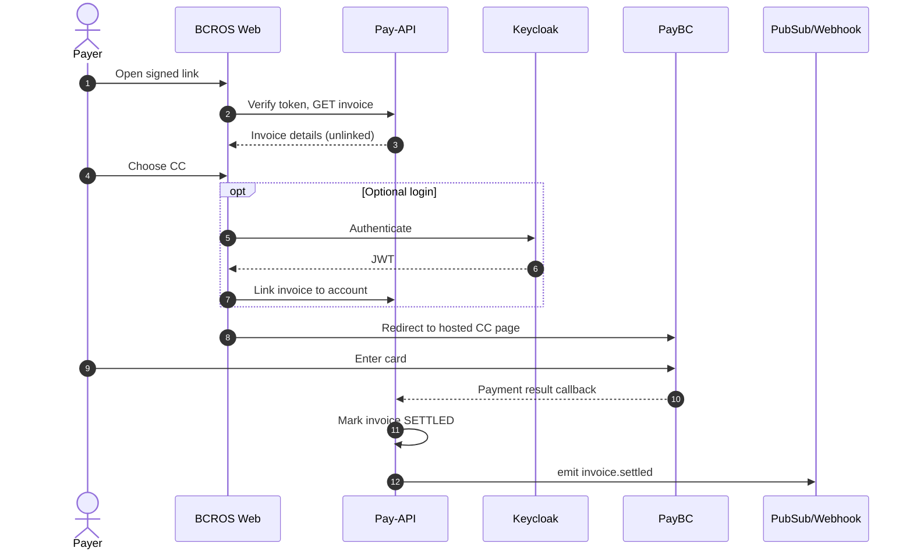
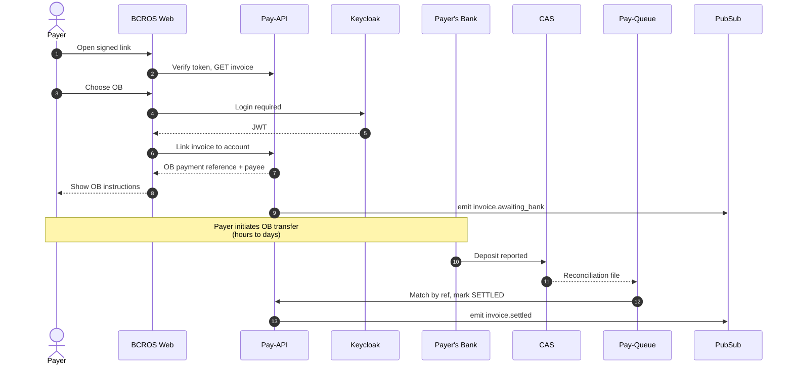
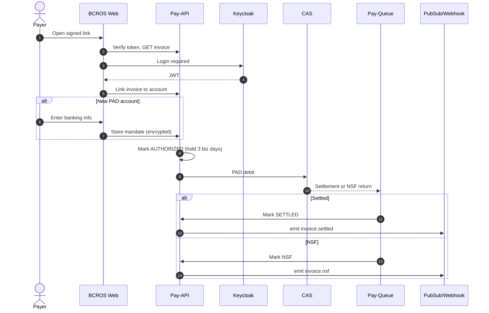

# Externally-Initiated Invoice Flow

Design for a hosted payment flow where an **external system** creates an
invoice in Pay-API without a linked BC Registries account, and the payer
completes payment on a hosted BCROS checkout via a signed email link.

Three payment rails are supported:

- **CC** — credit card via PayBC hosted page (guest or optional login)
- **OB** — online banking (login required, settlement via CAS recon)
- **PAD** — pre-authorized debit (login required, hold window before release)

The signed link is an **invoice locator**, not an auth token. Payer identity
is established by the rail itself (PayBC for CC, Keycloak for OB/PAD).

## 1. Container diagram

## 2. Sequence — CC (guest + optional login)

<!-- ## 3. Sequence — Online Banking

-->

## 3. Sequence — PAD

